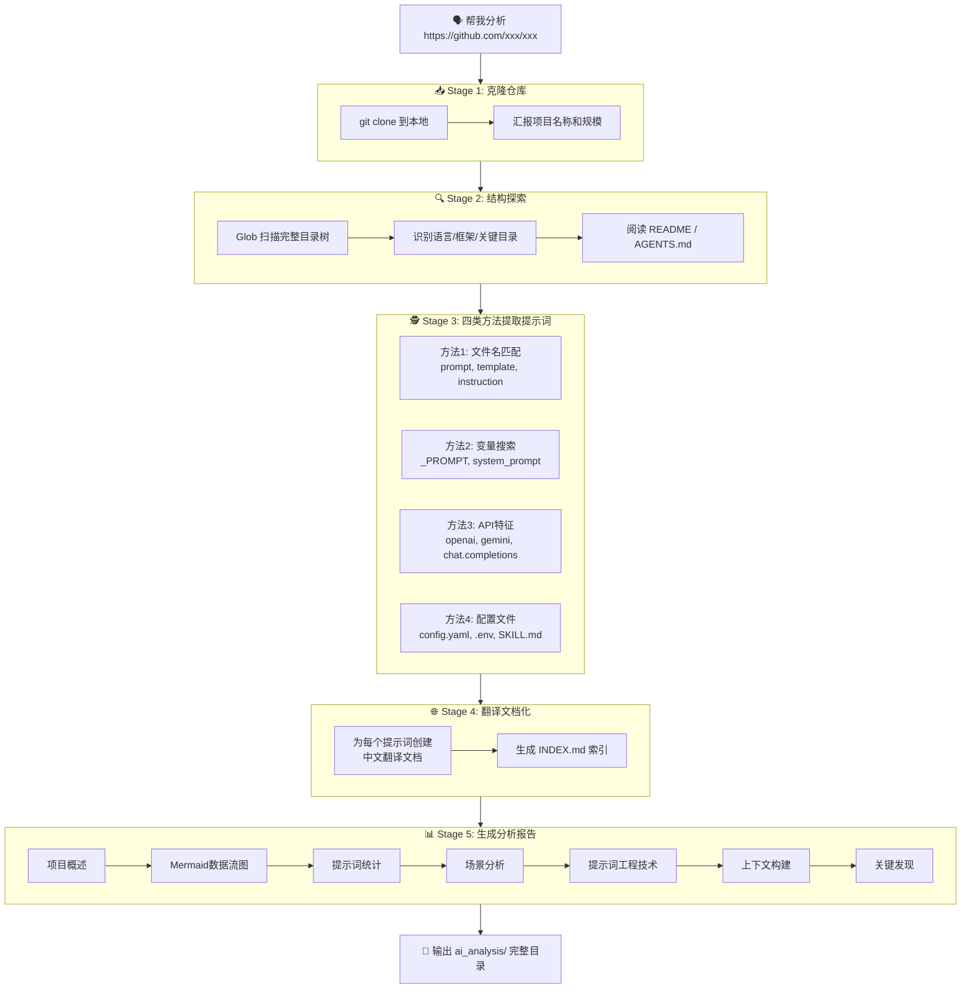

<div align="center">
  <h1>🔬 开源项目大模型应用分析器</h1>
  <p><strong>一键拆解任意 AI 开源项目 · 提示词 / API / Agent 模式全面透视</strong></p>
  <p>输入一个 GitHub 链接，自动提取所有提示词并翻译、绘制 Mermaid 数据流图、生成完整的中文分析报告。</p>
</div>

## 🤔 它解决什么问题

面对一个陌生的 AI 开源项目，你可能想知道：

- **这个项目到底用了哪些提示词？** 分散在 100+ 个文件里，逐行翻看要花大半天。
- **它怎么调用大模型的？** 用了 OpenAI 还是 Gemini？有 Function Calling 吗？是 Agent 架构吗？
- **提示词设计有什么亮点？** 有没有值得学的手法？有没有安全漏洞？
- **数据是怎么流转的？** LLM在架构里处于什么位置？

传统做法是：把代码克隆下来 → 逐文件搜索关键词 → 手动整理笔记 → 写文档。一个中等规模的项目（500+ 文件）至少要花 2~3 小时。

这个 Skill 把整套流程自动化了。五分钟，一份结构化报告到手。

### 🧭 Before / After

| 对比维度 | 传统方式（手动搜索） | 本 Skill |
| -------- | --------------- | -------- |
| **提示词提取** | 逐文件翻找，容易漏掉 | **4 类方法**系统扫描，0 遗漏 |
| **翻译整理** | 手动翻译，格式易丢失 | 自动翻译 + 保留 JSON/Markdown 原始格式 |
| **架构理解** | 靠直觉画图 | 自动生成 **Mermaid 时序图**，彩色分区 |
| **工具识别** | 容易忽略 Function Calling | 自动提取工具 **JSON Schema** 并翻译 |
| **报告产出** | 零散的笔记 | 一份 **7 节**的完整中文分析报告 |
| **耗时** | 2~3 小时 | **2~5 分钟** |

## 💬 一句话怎么用

> 「帮我分析一下这个项目 https://github.com/mvanhorn/last30days-skill」

或：

> 「拆解 https://github.com/xxx/xxx 的大模型用法」
> 「提取这个仓库的所有提示词」
> 「分析这个项目是怎么用 LLM 的」

AI Agent 自动完成以下全套流程：

1. **克隆仓库 (Clone)**：`git clone` 到本地工作目录。
2. **结构探索 (Explore)**：识别语言、框架、关键目录，读取顶层文档理解项目目的。
3. **提示词提取 (Extract)**：四类方法全量扫描——文件名匹配、代码变量搜索、API 调用特征、配置文件检查。
4. **翻译文档化 (Translate)**：为每个提示词生成中文翻译文档 + 索引。
5. **报告生成 (Report)**：产出一份包含 Mermaid 时序图、场景分析、提示词工程技术研判、工具清单的完整中文分析报告。

## 🏗️ 架构与工作流



## 🎯 产出文档结构

最终生成的 `ai_analysis/` 目录结构如下：

```
ai_analysis/
├── translated_prompts/
│   ├── INDEX.md                      ← 提示词索引表
│   ├── planner_query_prompt_zh.md    ← 每个提示词的翻译文档
│   ├── rerank_relevance_prompt_zh.md
│   ├── security_notices_prompt_zh.md
│   └── ... （N 个翻译文档）
└── AI_MODEL_USAGE_ANALYSIS.md        ← 综合大模型应用分析报告
```

其中 `AI_MODEL_USAGE_ANALYSIS.md` 包含：

1. **项目概述** — 名称、功能、技术栈
2. **数据流分析** — Mermaid 时序图 + 分阶段说明
3. **提示词分类统计** — 按类别统计表格
4. **应用场景分析** — 每个 LLM 调用的触发条件、输入输出、作用
5. **提示词工程技术** — Few-shot / CoT / Role-playing / 提示注入防御等
6. **上下文构建** — Agent 循环机制 + 工具 Schema 清单
7. **关键发现与洞察** — 值得学习的设计 + 优化空间 + 特色总结

## 🛠️ 安装与使用

### 导入 Skill

将 `open-source-llm-analyzer.zip` 解压到你的 Agent Skills 目录中，或直接通过 `npx skills` 安装。

### 触发方式

在对话框中提供 GitHub 仓库链接即可触发，例如：

```
帮我分析一下 https://github.com/mvanhorn/last30days-skill
```

```
拆解 https://github.com/langchain-ai/langgraph 项目的大模型用法
```

```
提取 https://github.com/crewAIInc/crewAI 所有提示词并翻译
```

### 前置要求

- 已安装 `git` 命令行工具
- Agent 具备 Bash（执行 git clone）、Glob、Grep、Read 工具权限
- 对于大型项目，建议在性能较好的环境下运行（搜索阶段涉及大量文件扫描）

## 📊 分析能力矩阵

| 能力维度 | 覆盖范围 |
| -------- | -------- |
| **LLM 提供商** | OpenAI、Google Gemini、Anthropic Claude、xAI Grok、OpenRouter、本地模型 |
| **提示词类型** | 系统提示词、规划提示词、评分/判断提示词、搜索提示词、安全声明、动态生成模板 |
| **Agent 模式** | Tool Use / Function Calling、多 Agent 协作、Plan-Execute 循环、ReAct 模式 |
| **输出语言** | 中文报告（代码引用和文件路径保留原文） |
| **支持语言** | Python、TypeScript/JavaScript、Go、Rust、Java（自动识别） |

## 🤝 贡献与支持

欢迎提交 Issue 或 Pull Request。如果你觉得这个工具对你有帮助，不妨给个 ⭐️ Star！

## ⚖️ 免责声明

本 Skill 提供的分析结果均基于自动化大模型能力，仅供参考和学习用途。对于分析结论的准确性不做保证，使用者需自行核实关键信息。

## 📜 许可证

基于 [MIT License](LICENSE) 开源，允许自由使用、修改和分发。
