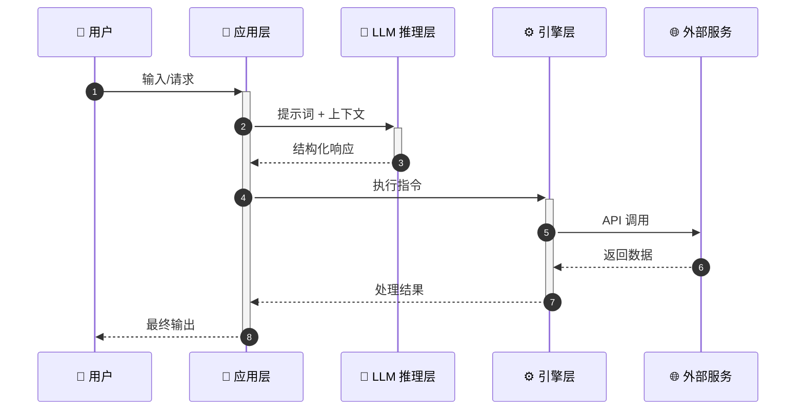

# 输出模板参考

## 模板 1：提示词翻译文档

```markdown
# 提示词翻译文档：[功能描述]

## 元信息
- 原文件位置: `{file_path}:{line_number}`
- 变量名称: `{variable_name}`
- 功能模块: {所属的功能模块}
- 调用场景: {何时、如何触发此提示词}

## 中文翻译

{逐行翻译的完整中文文本，保留原始 JSON 结构、Markdown 格式、代码块等}

## 关键参数
- `{param1}` - {参数说明}
- `{param2}` - {参数说明}

## 相关代码上下文
{简要说明该提示词在代码中的使用方式、调用链路、错误处理和回退机制}
```

---

## 模板 2：提示词翻译索引 (INDEX.md)

```markdown
# {项目名称} 提示词翻译索引

| 序号 | 文档 | 原文件 | 功能描述 |
|------|------|--------|----------|
| 1 | [{功能描述}]({文件名}) | `{原始文件路径}` | {一句话功能说明} |

共识别并翻译 **{N}** 个提示词文档。
```

---

## 模板 3：AI_MODEL_USAGE_ANALYSIS.md 分析报告

````markdown
# {项目名称} 大模型应用分析报告

## 1. 项目概述
- 项目名称: {name}
- 项目描述: {基于 README 的简要描述}
- 主要功能:
  - {功能1}
  - {功能2}
- 技术栈:
  - 核心语言：{语言和版本}
  - LLM 提供商：{列出所有调用的 LLM API}
  - 主要依赖：{关键框架和库}

## 2. 项目逻辑或数据流分析



**数据流说明（对应时序图中的阶段）：**
{按阶段详细说明每个步骤的输入、处理和输出}

## 3. 提示词分类统计

| 类别 | 数量 | 用途说明 |
|------|------|----------|
| 系统提示词 | X | ... |
| 用户交互提示词 | X | ... |
| 任务处理提示词 | X | ... |
| 评分/判断提示词 | X | ... |
| 安全性声明 | X | ... |
| **合计** | **N** | |

## 4. 大模型应用场景分析

### 场景 1: {场景名称}
- 触发条件: {何时触发}
- 使用的提示词: [{文档名}](translated_prompts/{文件名})
- 代码位置: `{path/to/file.py}:{line}`
- 输入输出:
  - 输入: {输入描述}
  - 输出: {输出描述}
- 作用: {该场景在项目中的作用和价值}

### 场景 N: ...
{每个独立的 LLM 调用场景一个子章节}

## 5. 提示词工程技术

### 使用的技术:
- **{技术名}**: {在项目中的具体应用}
- ...

### 提示词模板化:
{是否使用模板引擎、动态变量注入方式}

### 动态提示词生成:
{是否根据上下文动态生成提示词、有哪些动态变量}

## 6. 上下文构建

### 是否为 LLM Agent
{判断标准：LLM 是否自主多轮决策、是否在循环中}

### Agent 循环机制
{LLM makes the loop → LLM in the loop → LLM ends the loop 的具体体现}

### 为 LLM 提供的工具

{如果有 Tools/Function Calling}

#### 工具 1: {工具名称}

**工具 Schema（翻译）：**
```json
{
  "type": "{tool_type}",
  "parameters": {...}
}
```

**工具描述（中文翻译）：**
{工具的 description 翻译为中文}

**为什么这个工具对 LLM 有价值：**
{该工具在什么场景下提供什么上下文价值}

## 7. 关键发现与洞察

### 值得学习的提示词设计
1. **{设计亮点 1}**: {具体说明}
2. **{设计亮点 2}**: {具体说明}

### 可能的优化空间
1. **{优化点 1}**: {当前问题和改进建议}
2. **{优化点 2}**: {当前问题和改进建议}

### 总结：项目的大模型应用特色
{3-5 点总结，概括该项目的 LLM 应用方法论}
````
